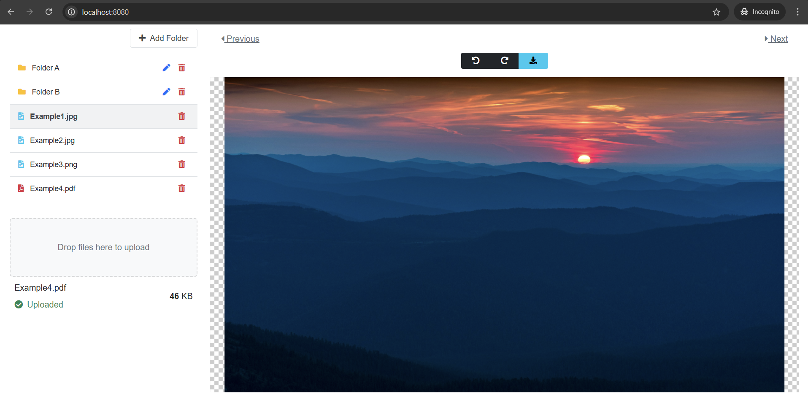

# File Upload System
A file management system built with Spring Boot REST API, AJAX, and jQuery. Users can upload, view, delete and organize files. 

  

## Tech Stack
- Backend: Spring Boot (REST API)
- Frontend: jQuery, Bootstrap, Dropzone.js, Cropper.js, Bootbox.js, FontAwesome
- Database: H2


## Run the Application with Docker
1. Build the Docker Image:
```
docker build -t seraaaaaaaa/file-upload .
```
2. Run the Docker Container:
```
docker run -d -p 8080:8080 --name file-upload seraaaaaaaa/file-upload
```

## Access the Application
http://localhost:8080/
