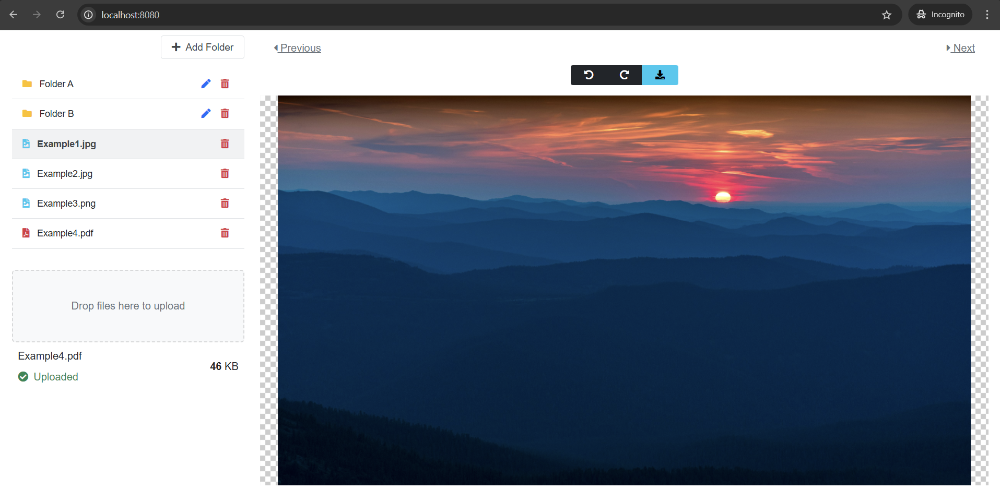

# File Upload System
A file management system built with Spring Boot REST API, AJAX, and jQuery. Users can upload, view, delete and organize files. 

  

## Tech Stack
- Backend: Spring Boot (REST API)
- Frontend: jQuery, Bootstrap, Dropzone.js, Cropper.js, Bootbox.js, FontAwesome
